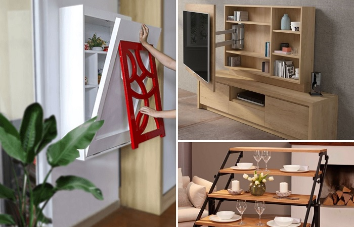
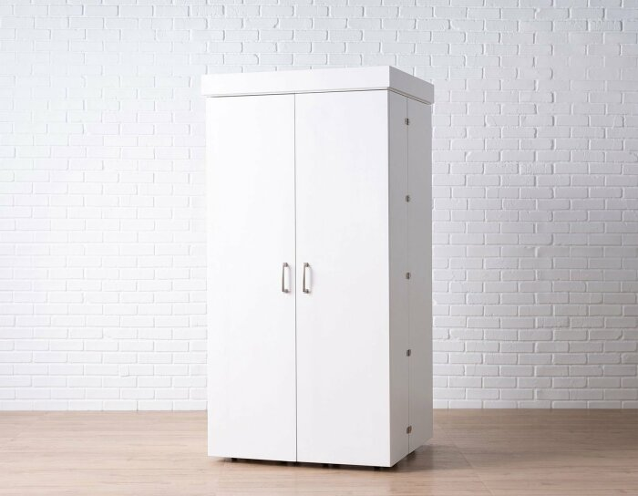
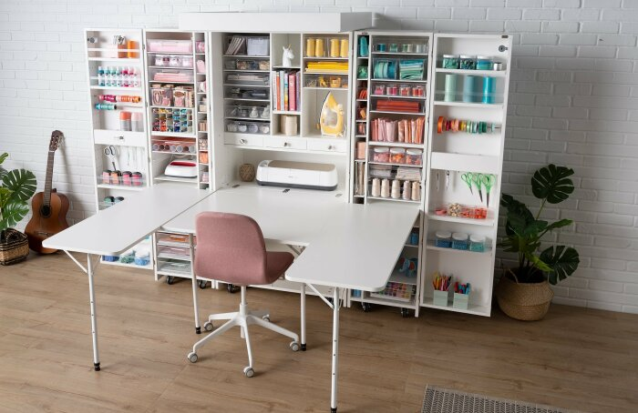
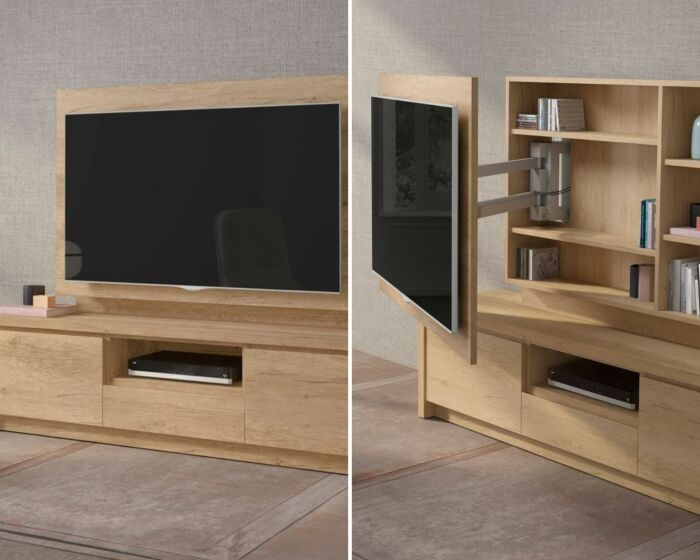
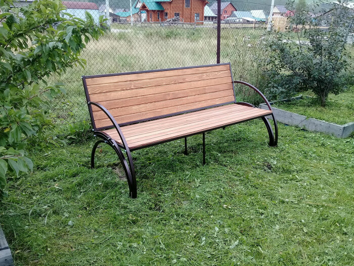
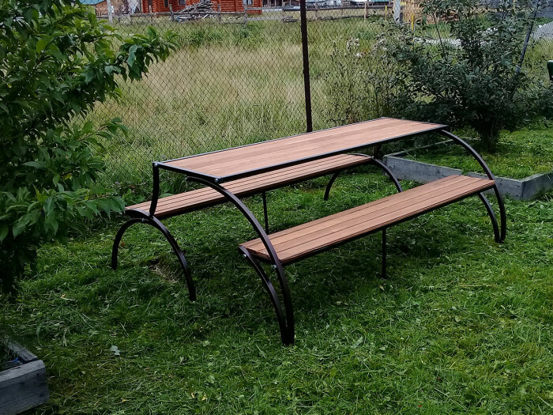

# 4 furniture models that take comfort to a new level

We are trying to make our homes as free and comfortable as possible, and the multifunctionality of the environment has already gone beyond the trend and has become a cult for modern man. The creation of such an interior, which combines practicality and comfort, is greatly helped by furniture-transformer, where one element can act in different roles, changing the function depending on the situation. The Novate.ru selection includes 11 interesting models that change shape.

## Cabinet-work table of a needlewoman

The amazing design of DreamBox is the perfect solution for the needlewoman. A stylish compact cabinet does not take up much space, but when you open the doors it unfolds into a full working space with a retractable table. With DreamBox you can forget about the mess - adjustable open shelves, hooks and rods create an ergonomic storage system where every needlework item finds its place and is visible and within easy reach.

And when your work is done, it's just as easy to transform the creative station back into a compact closet.

## Rotating TV panel with shelves

When hanging the TV, it can't fit snugly against the wall because of the bracket. The departure is small, but the designers decided that even this space can be used wisely. And they found a simple but elegant solution: they turned the pivoting panel into a cabinet door. Combined with a nightstand, the element forms a stylish and functional set for the living room. The cabinet turned out narrow, however, and not wide shelves are always useful for placing some things.

## Bench-table

Usually, transformer furniture is created for enclosed spaces because of the limited space of apartments. The garden area is more spacious, but still, why put two pieces of furniture when you can get by with one that replaces both, like a bench-table? It looks elegant, and it is comfortable to sit on in the evening, reclining on the back. And if necessary, with one movement the bench turns into a table and two benches that can comfortably seat six adults. A convenient and practical solution that creates comfort without cluttering the space.

Interesting fact: This bench-table model was designed by an English craftsman and presented it online in late 2018. He makes no secret of his design and sells the making instructions for $25. Using these blueprints, a home craftsman who knows how to work with tools will be able to make a transformer bench himself.

